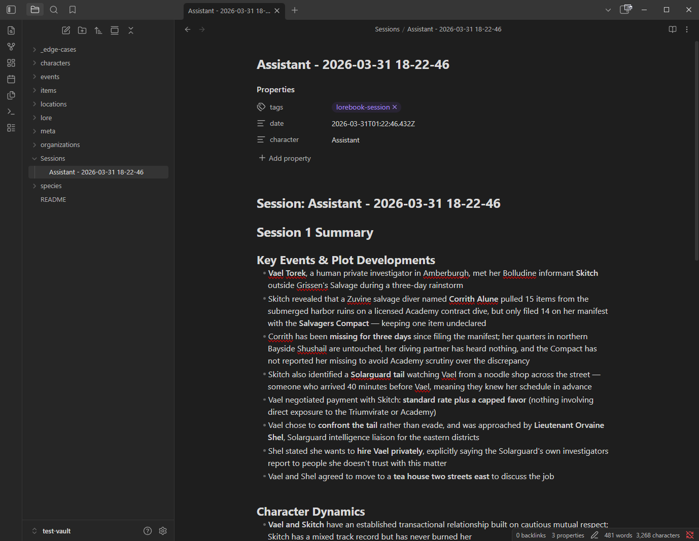

# AI-Powered Tools

Features that use AI to help you build, maintain, and get more value from your vault. These are separate from AI Search (which selects entries during generation) — these tools actively create or improve vault content.

---

## Session Scribe

Automatically summarizes your roleplay sessions and writes them as timestamped markdown notes to your Obsidian vault.

**How it works:**
1. Tracks actual chat position — after every N new messages (configurable), Scribe generates a summary
2. The summary is written as a markdown file to the configured Session Folder in your vault
3. Notes include frontmatter with timestamp, character name, and chat ID
4. Each summary builds on the previous one — the prior note is fed as context so the AI doesn't repeat itself

**On-demand:** Use `/dle-scribe` to write a summary at any time. Optionally pass a focus topic: `/dle-scribe What happened during the trial?`

**Connection options:**
- **SillyTavern** (default): Uses your active AI connection via generateQuietPrompt
- **Connection Profile**: Use any saved Connection Manager profile — lets you route summaries through a different model/provider
- **Custom Proxy**: Use a separate proxy server (claude-code-proxy or compatible Anthropic Messages API endpoint)

**Setup:**
1. Enable "Enable Session Scribe" in [[Settings Reference|Session Scribe settings]]
2. Set the auto-scribe interval (every N messages)
3. Set the Session Folder (default: `Sessions`)
4. Choose a connection mode (SillyTavern, Connection Profile, or Custom Proxy)
5. Optionally customize the summary prompt and message window depth

**Notes:**
- Writes directly to the Obsidian vault via the Local REST API
- Default prompt covers events, character dynamics, revelations, and state changes in past tense
- Configurable message window (default: 20 messages) and response token limit (default: 1024)
- Browse past notes with `/dle-scribe-history`

---

## Auto Lorebook

AI analyzes your chat for characters, locations, items, and concepts that are mentioned but don't have an existing lorebook entry, then suggests new entries you can review and accept.

**How it works:**
1. After every N messages (configurable), or on-demand via `/dle-newlore`, the AI scans recent chat
2. It compares against existing entries and identifies gaps
3. Suggestions appear in a popup with title, type, keywords, summary, and content
4. Accept to write the entry to Obsidian, or reject to skip

**Connection options:**
- **SillyTavern** (default): Uses your active AI connection
- **Connection Profile**: Use any saved Connection Manager profile
- **Custom Proxy**: Use a separate proxy server

**Setup:**
1. Enable "Enable Auto Lorebook" in [[Settings Reference|Auto Lorebook settings]]
2. Set the trigger interval (every N messages)
3. Optionally set a target folder for new entries
4. Choose a connection mode

**Notes:**
- Existing entries are filtered out (case-insensitive title match)
- Accepted entries are written with proper frontmatter (type, priority, tags, keys, summary)
- Use `/dle-newlore` to trigger on-demand without enabling automatic suggestions

---

## Optimize Keys

Use `/dle-optimize-keys <entry name>` to have AI analyze an entry and suggest better keywords. The AI considers the entry's content, summary, and current keywords to recommend improvements.

**When to use:** When an entry isn't triggering as expected, or when you want a second opinion on keyword choices. The AI can spot synonyms, related terms, and trigger phrases you might have missed.

**Notes:**
- Shows suggestions in a popup for review — you apply changes in Obsidian
- Uses the AI Search connection settings

---

## Auto-Summary Generation

Generate AI summaries for entries that don't have a `summary` field. Good summaries improve AI search quality significantly.

**Usage:** `/dle-summarize` scans all indexed entries, identifies those without summaries, and generates AI summaries one at a time. Each summary is written directly to the entry's frontmatter in Obsidian.

**When to use:** After importing entries from another lorebook system, or when you've written a lot of entries without summaries. The `summary` field is what AI search uses to decide whether an entry is relevant, so filling in missing summaries improves selection quality.

---

## Scribe-Informed Retrieval

When enabled, the Session Scribe's latest summary is fed into the AI search context as additional story background. This gives the AI search a broader understanding of the ongoing narrative, helping it select entries relevant to the overall story arc rather than just the most recent messages.

**Setup:** Enable "Scribe-Informed Retrieval" in [[Settings Reference|AI Search settings]].

**Notes:**
- Requires Session Scribe to be enabled and to have written at least one summary for the current chat
- The scribe summary provides narrative context that extends beyond the scan depth window
- Particularly useful for long conversations where important plot points have scrolled past the scan window
