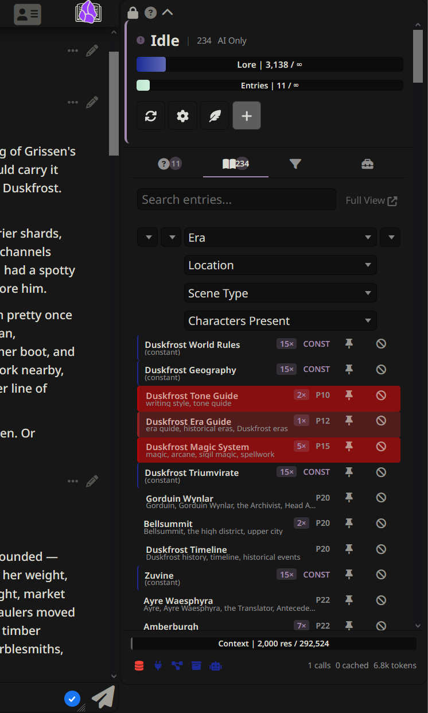

# AI Search

AI search is the second pipeline stage that asks an AI to pick relevant entries from a compact manifest of candidates. It catches entries the chat needs even when no exact keyword appears. This is the layer DeepLore added on top of pure keyword matching.



> [!NOTE]
> Two-stage mode is the default and what you want unless you have a reason. Keywords pre-filter, an AI ranks the candidates. Adds roughly one extra provider call per turn.

---

## How it works

When **Search Mode** is set to Two-Stage or AI Only, every generation runs:

1. **Build a manifest.** A compact summary of candidate entries is assembled (see [Manifest format](#manifest-format) below).
2. **Ask the AI.** The manifest, a system prompt, and recent chat messages are sent to an AI model. The model returns a JSON array of selected entries with confidence levels and reasons.

The selected entries (plus any constants and bootstrap entries) become the final injection set. See [[Pipeline]] for where AI search sits in the full flow.

---

## Search modes

The **Search Mode** dropdown in [[Settings Reference]] picks the mode. Three options:

### Two-stage (default)

Keywords run first as a broad pre-filter. Only keyword-matched candidates are sent to the AI. This keeps the manifest small (fewer tokens, lower cost, faster responses).

| Step | What happens |
|---|---|
| 1. Keyword scan | Matches entries against recent chat using `keys` |
| 2. Build manifest | Only keyword-matched entries are included |
| 3. AI selection | AI picks the most relevant from the candidates |
| 4. Output | AI selections + constants = final injection set |

**Error fallback:** AI error or timeout falls back to keyword results. AI returns `[]` (intentionally empty) and only constants are injected.

### AI only

Skips keyword matching entirely. A manifest of **all** non-constant vault entries is sent to the AI. More thorough (the AI can pick entries with no keyword overlap with chat) but costs more tokens and takes longer.

| Step | What happens |
|---|---|
| 1. Build manifest | All non-constant entries are included |
| 2. AI selection | AI picks the most relevant from the full vault |
| 3. Output | AI selections + constants = final injection set |

**Error fallback:** AI error or timeout falls back to keyword matching. AI returns `[]` and only constants are injected.

### Keyword only

Disables AI search entirely. Pure keyword + BM25 fuzzy matching, like base DeepLore. Free.

---

## Connection modes

AI search needs an AI model to call. Two connection modes are available.

### Connection Profile (recommended)

Uses a saved SillyTavern Connection Manager profile. Any provider works: Anthropic, OpenAI, OpenRouter, local models, anything you have set up in SillyTavern.

- No separate proxy or server needed
- Calls are made client-side via `ConnectionManagerRequestService`
- You can override the model (e.g., a cheap, fast Haiku-class model even if your profile defaults to a larger one)
- The profile dropdown shows all compatible saved profiles

**Setup:** in AI Search settings, set connection mode to **Connection Profile**, select a profile from the dropdown, and optionally set a model override. Click **Test AI Search** to verify.

### Custom Proxy

Routes AI requests through an external proxy server that exposes an Anthropic-compatible Messages API at `/v1/messages`. Requests pass through SillyTavern's built-in CORS proxy (`enableCorsProxy: true` required in `config.yaml`).

This mode exists primarily for [claude-code-proxy](https://github.com/horselock/claude-code-proxy) users.

**Setup:** set connection mode to **Custom Proxy**, enter the proxy URL (e.g., `http://localhost:42069`), set the model name (e.g., `claude-haiku-4-5-20251001`), and click **Test AI Search**. Confirm `enableCorsProxy: true` is set in `config.yaml`.

---

## Manifest format

The manifest is the compact entry list sent to the AI. Each entry looks like this:

```xml
<entry name="EntryName">
EntryName (150tok) → LinkedEntry1, LinkedEntry2
Summary or truncated content text. May include [Triggers: ...] [Related: ...] metadata.
</entry>
<entry name="NextEntry">
NextEntry (80tok)
Summary of the next entry.
</entry>
```

- **`<entry name="...">`:** XML delimiters prevent summary content from being interpreted as manifest-level instructions
- **`(Ntok)`:** estimated token cost of the full entry content. Lets the AI consider budget when selecting.
- **`→`:** wikilink relationships to other entries. Lets the AI follow chains.
- **Summary text:** comes from the `summary` frontmatter field if present. Otherwise the entry content is truncated to **Manifest Summary Length** (default 600 characters).

The manifest header tells the AI:
- How many candidate entries are in the manifest
- Total non-constant selectable entries from the candidate pool (in two-stage mode this is the keyword-matched count, not the full vault count)
- How many entries are always included (constants) and their token cost
- Token budget (if not unlimited)

### Why `summary` fields matter

If an entry has a `summary` frontmatter field, that summary goes into the manifest instead of truncated content. Good summaries describe *when* to select the entry, not just what it contains. See [[Writing Vault Entries]] for summary guidelines.

---

## The AI system prompt

The default system prompt instructs the AI to:

- Act as a lore librarian for the roleplay
- Select up to `{{maxEntries}}` entries (replaced with your Max Entries setting)
- Follow this priority order:
  1. **Direct references:** characters, places, items, or events explicitly mentioned
  2. **Active context:** current location, present characters, ongoing events
  3. **Relationship chains:** follow `→` links between related entries
  4. **Metadata triggers:** match `[Triggers: ...]` fields against the conversation
  5. **Thematic relevance:** tone and theme matching (betrayal, romance, combat, etc.)
- Prefer fewer, highly relevant entries over many loosely related ones
- Consider token cost when selecting
- Return a JSON array: `[{"title": "...", "confidence": "high|medium|low", "reason": "..."}]`
- Return `[]` if nothing is relevant

You can fully customize the system prompt in [[Settings Reference]]. The `{{maxEntries}}` placeholder is supported in custom prompts.

---

## Sliding window cache

AI search uses a single-entry sliding window cache to skip redundant API calls.

- The **manifest** and **chat context** are hashed separately
- If both hashes match the previous call, cached results are reused (exact match)
- If the manifest hash matches but chat has new messages, the cache checks whether the new messages contain any **entity names or keys** from the vault:
  - No vault entities mentioned: cached results are reused (the new messages are irrelevant to lore selection)
  - Vault entities mentioned: cache invalidated, fresh AI call made
- **Regenerations and swipes** always reuse cached results (same chat context)
- Cache is cleared on chat change

Cache hits show in the AI Stats display.

---

## New chat behavior

When the chat is below **New Chat Threshold** (default 3 messages), AI search behaves differently to help the AI understand a fresh conversation:

### Seed entries

Entries tagged `lorebook-seed` have their full content sent to the AI as **story context**, prepended before the chat messages. This provides rich setting information when the chat itself is sparse.

### Bootstrap entries

Entries tagged `lorebook-bootstrap` are **force-injected** like constants and removed from the manifest. They cover essentials at the start of a conversation.

### Aggressive selection

On new chats, the AI is told to fill to `maxEntries - constantCount` selections instead of being conservative. This ensures rich context from the very first message.

See [[Writing Vault Entries]] for how to tag entries as seed or bootstrap.

---

## Error handling

| Situation | Two-stage behavior | AI-only behavior |
|---|---|---|
| AI returns error | Fall back to keyword results | Fall back to keyword matching |
| AI times out | Same as error | Same as error |
| AI returns `[]` | Only constants injected | Only constants injected |
| AI response unparseable | Same as error | Same as error |
| No chat context | Skip AI search entirely | Skip AI search entirely |
| AI search disabled | Keywords only (base DeepLore behavior) | N/A |

The timeout is configurable (default 10000ms, range 1000-999999ms). Local LLMs may need 60000-120000ms; cloud APIs typically respond in 5000-15000ms. The cap is intentionally permissive — set past 120000ms only if your provider routinely runs longer.

**Circuit breaker:** AI search trips after 2 consecutive failures and stays open for 30 seconds. A successful half-open probe resets it.

---

## AI stats

The AI Search section of the settings panel shows session statistics:

- **AI Calls:** API calls made this session
- **Cache Hits:** times cached results were reused
- **Input Tokens:** estimated total input tokens sent
- **Output Tokens:** estimated total output tokens received

Both connection modes report token usage (profile mode falls back to `prompt_tokens` / `completion_tokens` if the provider returns those instead of `input_tokens` / `output_tokens`).

These stats are **session-scoped**. They accumulate across chat switches and reset only on page refresh, by design. They track total AI search usage for the browser session, not per-chat.

---

## Hierarchical manifest clustering

For large vaults (40+ selectable entries with 4+ distinct categories), AI search optionally uses a two-call approach:

1. **Cluster entries by category** (extracted from tags and type fields)
2. **First AI call: category selection.** A compact category manifest is sent; the AI picks relevant categories.
3. **Second AI call: entry selection.** Only entries in the selected categories are included in the normal manifest.

**Safety valve:** if the category filter would remove more than the configured threshold of entries (default 80%, controlled by **Category Filtering Strength** / `hierarchicalAggressiveness`, range 0.0-0.8), the pre-filter is skipped and the full manifest is used. Prevents overly aggressive AI category selection from hiding relevant entries.

**When it activates:** automatically when the vault has 40+ selectable (non-constant) entries and 4+ distinct categories, AND `hierarchicalPreFilter` is enabled.

---

## Prompt cache optimization

In **Custom Proxy mode**, the manifest is placed first in the message payload with `cache_control` breakpoints. This lets Anthropic's prompt caching reuse the manifest server-side (it rarely changes between calls in the same chat), reducing token costs on subsequent calls.

Custom Proxy mode only. Connection Profile mode does not support `cache_control` breakpoints.

---

## Scribe-informed retrieval

When enabled, the [[AI Powered Tools|Session Scribe]]'s latest summary is fed into the AI search context as additional story background. This widens what AI search can reason about beyond the recent chat messages.

**Setup:** enable **Scribe-Informed Retrieval** in [[Settings Reference|AI Search settings]].

---

## Confidence-gated budget

AI search over-requests entries from the AI (2x the configured max entries), then sorts results by confidence tier:

1. **High confidence** entries fill first
2. **Medium confidence** entries fill remaining budget
3. **Low confidence** entries only if budget remains

Ensures that when budget is limited, the most relevant entries are always included.

---

## Performance tips

- **Write `summary` fields** on your entries. Avoids content truncation in the manifest and gives the AI better information for selection. See [[Writing Vault Entries]].
- **Use Two-Stage mode** to reduce manifest size. Keywords pre-filter; the AI only sees relevant entries instead of the entire vault.
- **Keep Manifest Summary Length reasonable.** The default of 600 characters is a good balance.
- **Keep AI Scan Depth low.** The default of 4 messages is usually enough. Higher values send more chat history to the AI, increasing token cost.
- **Use a fast, cheap model.** AI search is simple classification. Haiku-class models handle it well and respond quickly. You do not need a frontier model.
- **Let the cache work.** Regenerations and swipes are free. The sliding window cache also reuses results when new messages don't mention vault entities.
- **Enable Scribe-Informed Retrieval** if you use Session Scribe. The narrative context helps for ongoing story arcs.

---

## Related pages

- [[Pipeline]]: where AI search fits in the full generation flow
- [[Settings Reference]]: every AI search setting documented
- [[Writing Vault Entries]]: how to write entries and summaries that work well with AI search
- [[AI Powered Tools]]: Session Scribe, Auto Lorebook, the Librarian, and other AI features
- [[Features]]: overview of all DeepLore features
- [[Installation]]: how to set up AI search connections
