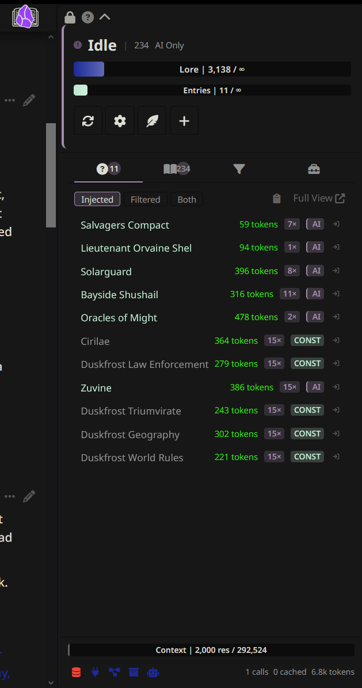
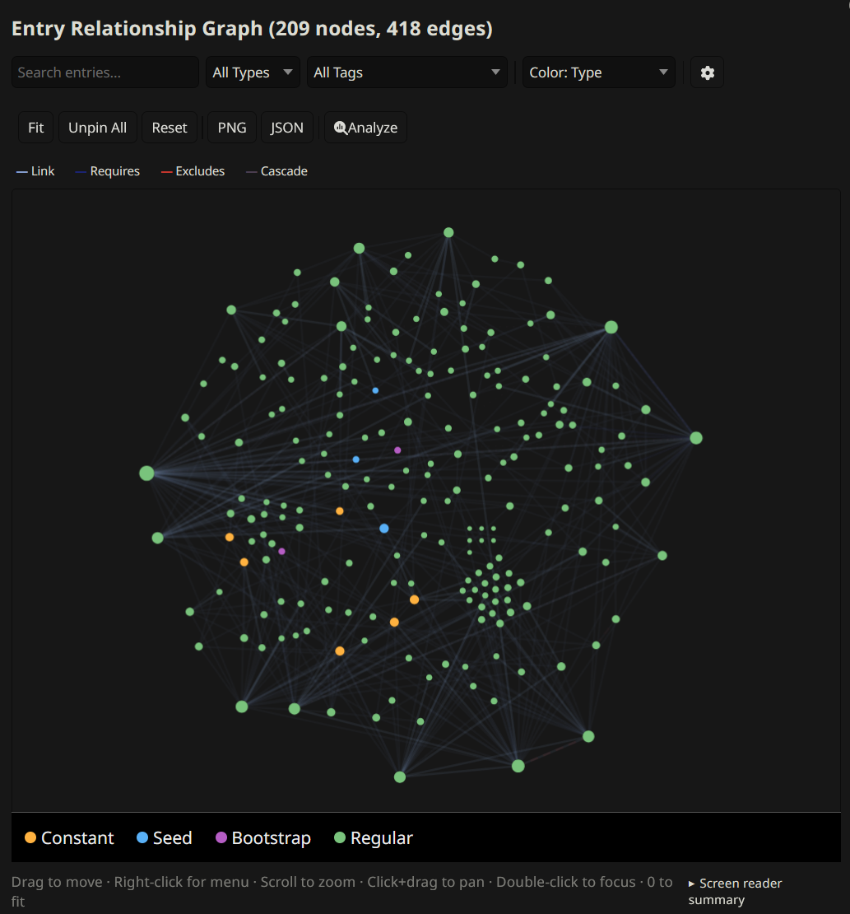
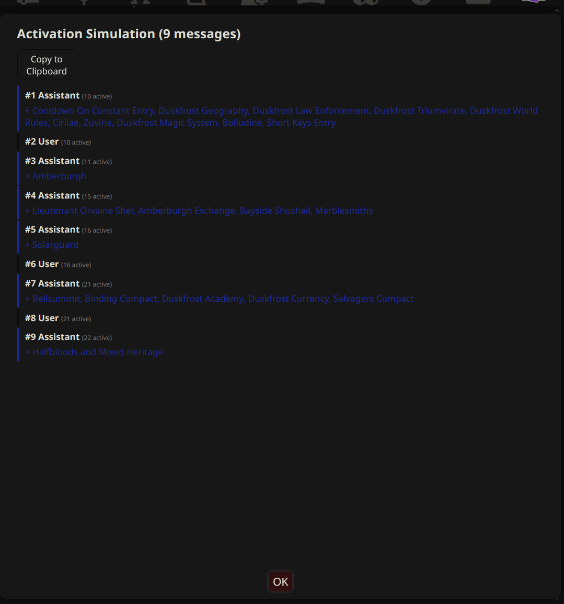

# Features

DeepLore is feature-dense. This page is a quick catalog with links to the detail pages where each feature is fully explained.

For the core matching pipeline, see [[Pipeline]]. For AI search specifics, see [[AI Search]].

---

## Live drawer panel

DLE's persistent side panel shows real-time pipeline feedback. See [[Drawer]] for full details.

| Feature | What it does |
|---------|-------------|
| **Injection tab** | Shows which entries were injected and why, with generation-to-generation diff |
| **Browse tab** | Searchable, filterable entry list with temperature heatmap, pin/block controls, and virtual scroll |
| **Filters tab** | View and edit contextual gating filters (built-in and custom fields) with live impact counts and folder filter |
| **Librarian tab** | Lore gap inbox, flagged entries, draft activity, and bulk actions |
| **Tools tab** | Quick-access buttons for slash commands, grouped by purpose |
| **Status zone** | Connection status, token/entry budget bars, active gating filters, quick action buttons |
| **Footer** | Context window bar, recent activity feed, health icons, AI session statistics |

---

## Inspection and diagnostics

Tools for understanding what DLE is doing and why. See [[Inspection and Diagnostics]] for full details.

| Feature | What it does |
|---------|-------------|
| **Context Cartographer** | Book icon on each AI message showing which entries were injected and why |
| **Pipeline Inspector** | Detailed trace of the last generation (`/dle-inspect`) |
| **Entry Browser** | Searchable popup of all indexed entries (`/dle-browse`) |
| **Relationship graph** | Interactive force-directed graph of entry connections (`/dle-graph`) |
| **Activation Simulation** | Replay chat history showing entry activation timeline (`/dle-simulate`) |
| **"Why Not?" diagnostics** | Click any unmatched entry to see exactly why it was not injected |
| **Entry analytics** | Track match and injection counts per entry (`/dle-analytics`) |
| **Health check** | 30+ automated checks for common entry issues (`/dle-health`) |
| **Diagnostics export** | Pseudonymized bundle for bug reports (`/dle-diagnostics`); IPs, hostnames, API keys, profile names, vault names, and character names masked |

---

## AI tools

Features that use AI to help you build and maintain your vault. See [[AI-Powered Tools]] for full details.

| Feature | What it does |
|---------|-------------|
| **Session Scribe** | Auto-summarize sessions and write notes back to your vault |
| **Auto Lorebook** | AI suggests new entries based on chat content (`/dle-newlore`) |
| **Optimize Keys** | AI analyzes an entry and suggests better keywords (`/dle-optimize-keys`) |
| **Auto-Summary** | Generate AI summaries for entries missing a `summary` field (`/dle-summarize`) |
| **Scribe-informed retrieval** | Feed Scribe summaries into AI search for broader story awareness |

---

## Librarian

Two linked things: writing-AI tools (`search` and `flag`) that run during generation, and Emma, the chat agent for authoring entries from flagged gaps. The Librarian has its own drawer tab, settings subtab, and connection channel. Tool-calling provider required (Claude, Gemini, OpenAI-compatible, Cohere).

| Feature | What it does |
|---------|-------------|
| **Generation tools** | Writing AI calls `search` and `flag` mid-generation to look up vault entries and flag gaps |
| **Emma's toolset** | `search_vault`, `get_entry`, `get_full_content`, `find_similar`, `list_flags`, `get_links`, `get_backlinks`, `list_entries`, `get_recent_chat`, `flag_entry_update`, `compare_entry_to_chat`, and `get_writing_guide` |
| **Session continuity** | Emma's session (messages, draft state, work queue) persists in `chat_metadata` across reloads and chat switches |
| **Lore gap detection** | Writing AI flags missing or stale lore mid-generation; gaps land in the Librarian inbox; Emma helps you draft the entry |
| **Two-tier dismissal** | Hide a gap to suppress it; dismiss again to bury it. Re-flagging a hidden gap resurfaces it |
| **Vault audits** | `/dle-librarian audit` walks the entire vault and flags gaps, inconsistencies, and entries that need updates |
| **Writing guides** | Tag a vault entry with `lorebook-guide` to make it a Librarian-only style reference. Emma fetches these via `get_writing_guide`. They never reach the writing AI through any path |
| **Drawer tab** | Gap list, flagged entries, session stats, and quick-dismiss controls |
| **Customizable persona** | Tweak Emma's personality and focus through an editable prompt |

> [!IMPORTANT]
> Turning on the Librarian auto-enables function calling on the active connection profile. If you disable function calling elsewhere, tool invocations break.

---

## AI Notepad

Per-chat AI-extracted session notes injected into context. The AI maintains running notes about important story details (decisions, relationship changes, revealed secrets) using `<dle-notes>` tags. Notes are stripped from visible chat, accumulated per-chat in `chat_metadata.deeplore_ai_notepad`, and reinjected into future messages as context.

| Feature | What it does |
|---------|-------------|
| **Tag extraction** | AI wraps notes in `<dle-notes>` tags; DLE extracts and stores them, then strips them from the visible message |
| **Per-chat storage** | Notes stored on `chat_metadata.deeplore_ai_notepad`; accumulate as the chat grows |
| **Configurable injection** | Position, depth, and role controls; same pattern as Author's Notebook |
| **Per-message tracking** | Each message's extracted notes stored on `message.extra.deeplore_ai_notes`; visible in Context Cartographer |
| **Independent connection** | Separate connection channel for the extraction call |
| **`/dle-ai-notepad`** | View, edit, or clear accumulated notes |

---

## Entry matching and behavior

Per-entry frontmatter fields and global settings that control when entries trigger. See [[Entry Matching and Behavior]] for full details.

| Feature | What it does |
|---------|-------------|
| **Cooldown** | Skip an entry for N generations after it triggers |
| **Warmup** | Require N keyword occurrences before first trigger |
| **Re-injection cooldown** | Global setting to skip re-injecting recent entries |
| **Injection dedup** | Strip entries already injected in recent generations |
| **Entry decay and freshness** | Boost stale entries, penalize over-injected ones |
| **Conditional gating** | `requires` and `excludes` dependency rules |
| **Refine keys** | Secondary AND_ANY filter on top of primary keywords |
| **Cascade links** | Unconditionally pull in related entries when one matches |
| **Active character boost** | Auto-match the active character's entry |
| **Fuzzy search (BM25)** | TF-IDF scored fuzzy matching alongside exact keywords; inverted-index posting list |
| **Bootstrap and seed entries** | `lorebook-bootstrap` for chat-start force-injection; `lorebook-seed` for new-chat story context |
| **Probability** | 0.0-1.0 trigger chance for matched entries |

---

## Injection and context control

How and where entries are injected, plus per-chat overrides. See [[Injection and Context Control]] for full details.

| Feature | What it does |
|---------|-------------|
| **Per-entry injection position** | Override position, depth, and role per entry |
| **Prompt Manager integration** | Register DLE injections as draggable Prompt Manager entries (`injectionMode: prompt_list`) |
| **Author's Notebook** | Persistent per-chat user scratchpad injected every generation (`/dle-notebook`) |
| **Per-chat pin and block** | Pin entries to always inject or block them, per chat |
| **Contextual gating** | Filter entries by era, location, scene type, characters present, and user-defined custom fields (configurable via the rule builder) |
| **Confidence-gated budget** | AI over-requests, then prioritizes high-confidence picks |
| **Folder filter** | Per-chat folder restriction; only entries in allowed folders are considered |

---

## Infrastructure

Under-the-hood systems that make DLE fast and reliable. See [[Infrastructure]] for full details.

| Feature | What it does |
|---------|-------------|
| **Multi-vault support** | Connect multiple Obsidian vaults simultaneously; entries deduped by content hash across vaults |
| **IndexedDB persistent cache** | Instant startup from browser-side cache |
| **Reuse sync** | Skip re-parsing unchanged entries on refresh |
| **Circuit breaker** | Exponential backoff on Obsidian connection failures; AI search circuit trips after 2 consecutive failures (30s cooldown) |
| **Prompt cache optimization** | Anthropic prompt caching for proxy mode AI calls |
| **Sliding window AI cache** | Reuse AI results when chat changes are lore-irrelevant |
| **Hierarchical manifest clustering** | Two-call AI approach for vaults with 40+ entries |
| **HTTPS support** | Obsidian connections support HTTPS for remote or secured setups, with auto-diagnosis of cert/auth/unreachable failure modes |
| **Flight recorder** | Ring buffer captures recent extension activity (pipeline runs, tool calls, errors) for export |

---

## Setup and import

Getting started and migrating from other lorebook systems. See [[Setup and Import]] for full details.

| Feature | What it does |
|---------|-------------|
| **Setup wizard** | Guided first-time setup (`/dle-setup`) |
| **Quick actions bar** | One-click toolbar in the drawer |
| **ST lorebook import** | Convert SillyTavern World Info JSON into Obsidian vault notes (`/dle-import`); offers AI summary generation for imported entries |
