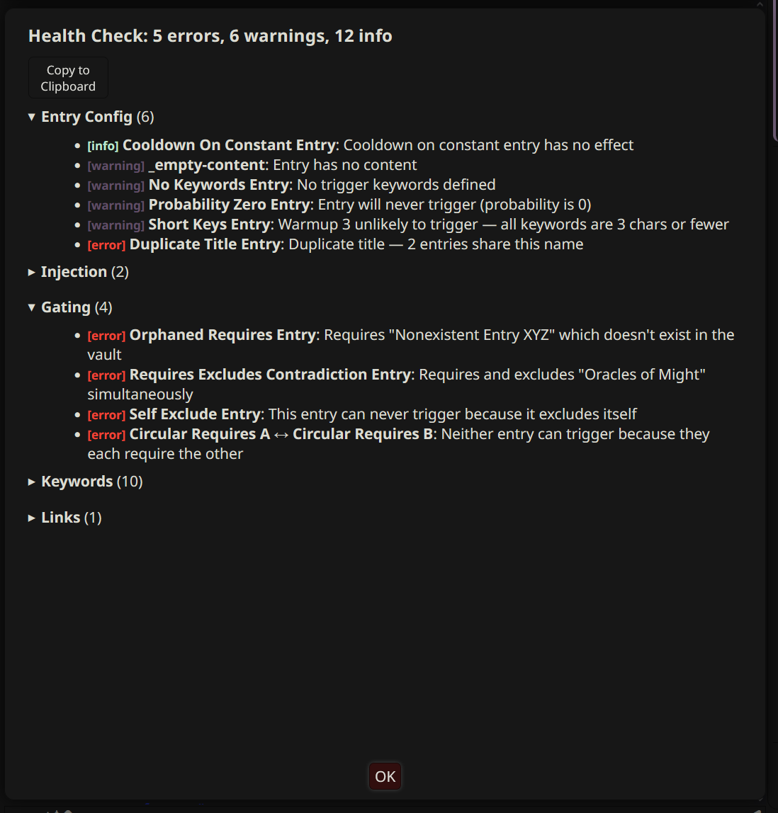

# Inspection and Diagnostics

Tools for understanding what DeepLore is doing, why entries did or did not inject, and how the vault is configured. Most of the surfaces here are also wired into the [[Drawer]] for inline use while chatting.

> [!NOTE]
> When something is misbehaving, the fastest path is usually `/dle-health` for config sanity, then `/dle-inspect` for the last generation, then `/dle-diagnostics` for a shareable export.

---

## Context Cartographer

Adds a book icon button to each AI message's action bar. Click it to see which vault entries were injected for that message, why they matched, and how much context they used.

**The popup shows:**
- Entry name (clickable link to Obsidian when vault connection names match Obsidian vault names)
- Match type: keyword, AI (with confidence and reason), constant, pinned, or bootstrap
- Priority value
- Token cost with a color-gradient bar (green/yellow/red relative to vault average)
- Entries grouped by injection position (Before Main Prompt, In-chat @depth, After Main Prompt)
- Generation-to-generation diff: `+new` and `-removed` entries with reasons (e.g. "Bootstrap fall-off", "No longer matched")
- Expandable content preview (first 300 chars with keyword highlighting)
- Vault source label (when multiple vaults are connected)
- Entry metadata: keys, requires, era, location, wikilinks

**Setup:**
1. Enable "Show Lore Sources Button" in [[Settings Reference|Context Cartographer settings]].
2. Set vault connection names to match your Obsidian vault names exactly to enable deep links.

**Notes:**
- Source data is saved per-message in `message.extra.deeplore_sources`, so it persists across sessions.
- The book icon only appears on messages that have lore source data.

---

## Pipeline Inspector

View a detailed trace of the last generation with `/dle-inspect`.

**Shows:**
- Pipeline mode (two-stage, ai-only, keywords-only)
- Per-stage timing breakdown
- Keyword matches with the specific keyword that fired
- BM25 fuzzy search stats (matched/candidates/threshold)
- AI selections with confidence and reason
- Fallback status (when AI search failed and keyword results were used instead)
- Constants and bootstrap entries
- Entries cut by budget or max-entry cap
- Probability skips with the rolled value
- Cooldown removals (per-entry and re-injection cooldown)
- Warmup failures (entries that did not meet the hit threshold)
- Refine-key blocks (entries where the primary key matched but no refine key did)
- Contextual gating removals with per-field mismatch reasons
- Folder filter info (entries removed by per-chat folder filter)
- Strip-dedup removals (entries already in recent context)

**When to use:** debug why an entry was or was not injected in the last generation. The inspector shows the full picture: what matched, what the AI picked, and what got filtered out.

See [[Slash Commands]] for the `/dle-inspect` command reference.

### Diagnostics export

`/dle-diagnostics` (alias `/dle-diag`) downloads two files:

- `dle-diagnostics-<timestamp>.md`: the anonymized report, safe to share.
- `dle-connections-reference-<timestamp>.md`: your unanonymized connection mapping, for your eyes only.

The anonymized report packages:

- DLE version, ST version, browser, URL
- Setup state and migration status
- Per-tool resolved connections (mode, target, model, timeout)
- Vault index summary (entry counts by tag, totals, oversized entries)
- Recent generations from the flight recorder ring buffer
- Recent console, network, error, and lifecycle events from the interceptor ring buffers
- AI call history (counts, latencies, errors)
- Long-task and memory snapshots from the performance interceptor

**What gets scrubbed:**
- API keys, tokens, OAuth secrets, passwords, cookies, bearer tokens (any field name matching a sensitive pattern is replaced with `<redacted>`)
- Bearer/Authorization values inside strings
- URL query-string credentials (`?key=`, `?token=`, etc.)
- Provider key formats: `sk-ant-...`, `sk-proj-...`, `sk_live_...`, `sk_test_...`
- IPv4 / IPv6 addresses (last two octets pseudonymized; same real IP maps to the same pseudonym within one export so cardinality survives)
- Email addresses and hostnames
- User home paths

**What is excluded outright** (never read into the export):
- Chat message bodies
- Vault entry content

The scrubber report at the top of the file lists how many of each thing was redacted. Different exports use independent pseudonym tables, so values cannot be correlated across files.

The verbose data block at the bottom is gzipped and base64-encoded so the report stays under typical attachment limits.

**When to use:** filing a bug report or asking for help. Open the file and verify the privacy section before sharing.

### Flight recorder

DLE always captures a compact summary of every generation into a 50-slot ring buffer (`generationBuffer`). This runs regardless of the debug-mode setting, so when you export diagnostics the most recent ~50 generations are always present.

Each entry records: per-stage timings, counts of keyword matches, AI selections, gating removals, cooldown skips, budget cuts, injection totals, AI fallback status, AI errors, budget usage, and a pseudonymized list of injected titles. Title pseudonyms are stable within a session but reset between sessions.

When the user stops a generation or the pipeline times out, the abort is recorded into the same buffer with the abort reason.

### Interceptor buffers

Always-on monkey patches feed several ring buffers:

- `consoleBuffer` (800 entries): every console call. `/dle-logs` drains DLE-prefixed entries from this buffer.
- `networkBuffer` (300 entries): fetch and XHR calls.
- `errorBuffer` (100 entries): `window.onerror` and unhandled promise rejections.
- `eventBuffer` (200 entries): DLE lifecycle events (chat changes, settings updates, index builds, AI circuit transitions).
- `aiCallBuffer` (40 entries): per-AI-call summary (caller, mode, target, timing, error).
- `aiPromptBuffer` (20 entries): full system+user prompt text. Only populated when `debugMode === true`. Scrubbed on export.

The interceptors are wrapped in try/catch so a bug in the diagnostic layer cannot break SillyTavern.

---

## Entry Browser

Browse all indexed entries via the **Browse tab** in the [[Drawer]], the `/dle-browse` popup, or the "Browse" button in the Quick Actions bar.

**Features:**
- Search by title or keyword (300ms debounce)
- Filter by status: all, injected, pinned, blocked, constant, seed, bootstrap, never injected
- Filter by tag (dynamic dropdown from vault tags)
- Sort by priority (asc/desc), alphabetical (A-Z/Z-A), token count (asc/desc), or injection count (desc)
- Temperature heatmap coloring: entries tinted hot (red) or cold (blue) based on injection frequency relative to vault average
- Per-chat injection count badges (e.g. "3x")
- Expandable detail view with content preview, keywords, metadata, and Obsidian deep link
- Inline pin/block buttons per entry (per-chat overrides)
- Virtual scrolling for large vaults (100+ entries)
- "Why not injected?" diagnostics on unmatched entries (see below)

**When to use:** quick review of the vault without switching to Obsidian. Good for keywords, priorities, token sizes, and injection patterns at a glance. The Drawer Browse tab provides the same functionality inline while chatting.

---

## "Why Not?" diagnostics

When an entry has keywords but did not inject, you can find out exactly why. The "Why Not?" diagnostic walks the entry through every pipeline stage and stops at the first failure.

**Where to access it:**
- In the **Entry Browser** (`/dle-browse`): unmatched entries show a "Why not?" button. Click it to see the diagnosis inline.
- In the **Pipeline Inspector** (`/dle-inspect`): the "Unmatched entries with keywords" section at the bottom shows inline diagnostics. Click an entry to expand.

**Diagnostic stages:**

The `diagnoseEntry()` function checks each pipeline stage in order and stops at the first failure:

| Stage | What it means |
|-------|--------------|
| `no_keywords` | Entry has no trigger keywords defined |
| `scan_depth_zero` | Scan depth is 0, so keyword matching is disabled |
| `keyword_miss` | None of the entry's keywords appear in the last N messages. If a keyword appears in older messages, the suggestion will tell you to increase scan depth. |
| `refine_keys` | Primary keyword matched, but none of the refine keys were found (the AND filter blocked it) |
| `warmup` | Keyword was found but not enough times to meet the warmup threshold |
| `probability` | Entry was matched but rolled out by its probability setting |
| `cooldown` | Entry is in per-entry cooldown (N generations remaining) |
| `reinjection_cooldown` | Entry was injected recently and is blocked by the global re-injection cooldown |
| `gating_requires` | One or more required entries are not currently matched |
| `gating_excludes` | An excluded entry is currently matched, blocking this one |
| `ai_rejected` | Entry was in the AI candidate list but the AI chose not to select it |
| `budget_cut` | Entry matched all filters but was cut by the budget limit or max-entry cap |

Each diagnosis includes a plain-language explanation and, where applicable, a suggestion for fixing the issue (e.g. "Increase scan depth from 4 to reach it" or "Improve the entry summary so the AI can decide when to select it").

---

## Activation simulation

Replay your chat history step by step with `/dle-simulate`. Shows which entries activate and deactivate at each message.

**How it works:**
1. The simulation walks through your chat from message 1 to the end.
2. At each message, it runs keyword matching against the entries (using your current scan depth and matching settings).
3. Constants are always active. Bootstrap entries are active until the chat exceeds the New Chat Threshold.
4. The timeline shows which entries turned on (`+green`) and off (`-red`) at each message boundary.

**The popup shows:**
- A scrollable timeline with one row per message
- Speaker name and count of active entries
- Newly activated entries highlighted in green
- Deactivated entries highlighted in red
- Messages where nothing changed are shown with a muted border
- Copy button to export the timeline as plain text

**When to use:** understand how your keywords behave across an entire conversation. Helps identify entries that:
- Trigger too early (keywords are too common)
- Trigger too late (keywords do not appear until deep into the conversation)
- Never trigger at all (keywords are wrong or too specific)
- Flicker on and off (keywords appear intermittently in the scan window)

**Notes:**
- The simulation uses keyword matching only. No AI search, no probability, no warmup, no cooldown. The result is deterministic.
- Per-entry scan-depth overrides are respected.
- Run after a conversation has some length to get a meaningful timeline.

---

## Relationship graph

Visualize entry relationships as an interactive force-directed graph with `/dle-graph`. Nodes are entries (color-coded by type and tags), edges are wikilinks, requires/excludes connections, and cascade links. Drag, zoom, pan.

**When to use:** explore the relationship structure of the vault. Identify clusters of related entries, orphaned entries with no connections, and long dependency chains.

**Notes:**
- Large vaults (200+ entries) may render slowly. The extension warns you before proceeding.
- Focus mode exits with the `e` key, not Escape (Escape would close the dialog).

---

## Entry analytics

Track how often each entry is matched and injected across generations. View with `/dle-analytics`.

**Shows:**
- Table sorted by injection count: entry name, match count, injection count, last-used timestamp
- "Never Injected" section for dead-entry detection

**Use case:** identify entries with bad keywords that never trigger, or entries that trigger too frequently.

**Notes:**
- Analytics persist in SillyTavern settings across sessions.
- Resets when you clear settings or reinstall.

### Librarian analytics

When the Librarian is enabled, the analytics popup also lists Librarian-related activity: tool calls made, entries created or updated, writing guides fetched, and gap analysis results. Top unmet queries (gaps the Librarian flagged but no entry was authored for) appear at the bottom.

Librarian session stats are tracked at the session level (not reset on chat change). Per-chat Librarian stats track activity within the current chat.

---

## Entry health check

Audit vault entries and settings for common issues with `/dle-health`. Runs 30+ checks across multiple categories.

**Check categories:**
- **Multi-vault:** enabled vaults, API key validation
- **Settings:** scan depth disabled, AI mode without profile, proxy URL missing, budget too low, cache TTL, index staleness
- **Entry config:** duplicate titles, empty keys, empty content, orphaned requires/excludes/cascade_links, requires + excludes same title, self-excluding entries, oversized entries (>1500 tokens), missing summary
- **Gating:** circular requires, unresolved wikilinks, conflicting overrides
- **AI search:** entries without summary fields
- **Keywords:** short keywords (2 chars or less), duplicate keywords across entries
- **Size:** constants exceeding budget, seed entries >2000 tokens
- **Injection:** depth/role override without `in_chat` position
- **Entry behavior:** cooldown on constants, warmup unlikely to trigger, bootstrap with no keywords, probability zero, excluded from recursion with no keywords

**When to use:** after adding or modifying entries, or when entries are not matching as expected. The health check catches misconfiguration that is easy to miss in a large vault.

---

## Parser lint

`/dle-lint` (alias `/dle-l`) shows parser warnings and skipped entries from the last vault index build. The toast that appears after `/dle-refresh` mentions warnings or skips when there are any. Run lint to see which files were affected and why (missing frontmatter, malformed YAML, missing lorebook tag, oversized content, etc.).
