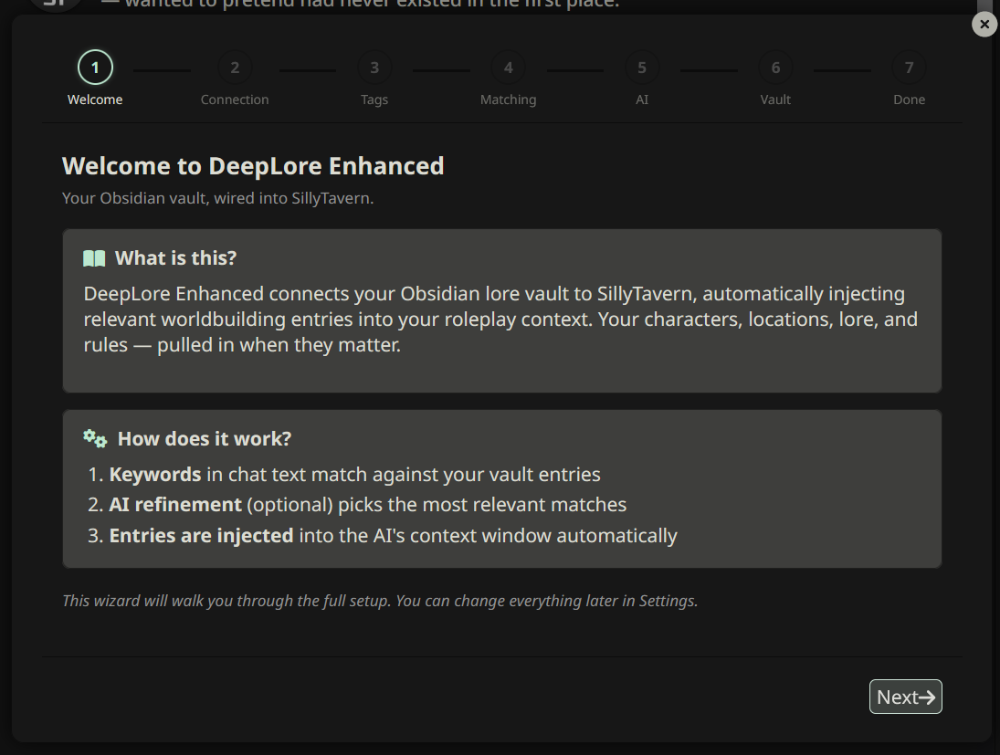
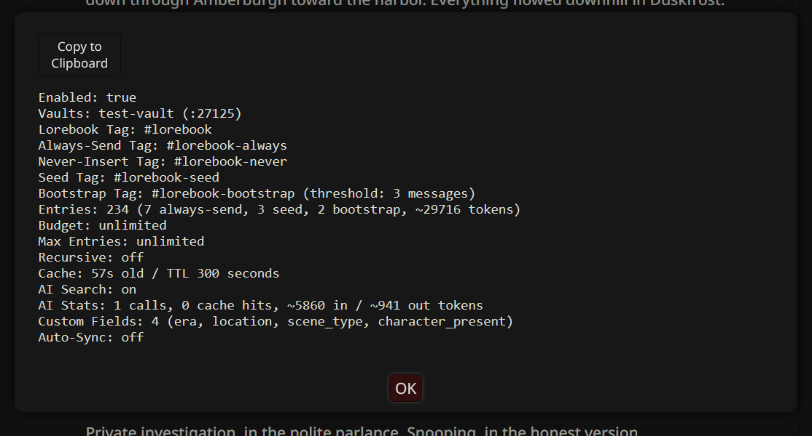

# Quick Start

Get DeepLore Enhanced injecting lore in 5 minutes.

## Prerequisites

1. **Obsidian** with the [Local REST API plugin](https://github.com/coddingtonbear/obsidian-local-rest-api) installed and enabled
2. **SillyTavern** with DeepLore Enhanced installed (see [Installation](Installation))

## Step 1: Connect Your Vault



> **Tip:** Run `/dle-setup` to launch the guided setup wizard shown above.

1. Open SillyTavern → Extensions → DeepLore Enhanced
2. Under **Vault Connections**, your default vault should already be there
3. Enter the **Port** (default: `27123`) and **API Key** from the Obsidian REST API plugin settings
4. Click **Test All** — you should see a green checkmark

> **Where's my API key?** In Obsidian, go to Settings → Community Plugins → Local REST API → copy the "API Key" field.

## Step 2: Create a Test Entry

In Obsidian, create a new note with this content:

```markdown
---
tags:
  - lorebook
keys:
  - magic
  - spellcasting
summary: "The magic system of this world. Select when magic, spells, or supernatural abilities come up."
priority: 50
---

# Magic System

Magic in this world is powered by willpower and channeled through spoken incantations.
Novice practitioners can only manage simple cantrips, while masters can reshape reality itself.
```

The key parts:
- `tags: [lorebook]` — marks this note for DeepLore to index
- `keys: [magic, spellcasting]` — keywords that trigger this entry
- `summary` — helps AI search decide when to select this entry

## Step 3: Enable and Index

1. Check **Enable DeepLore Enhanced** in settings
2. Click **Refresh** (or type `/dle-refresh` in chat)
3. You should see "1 entries" in the header badge

## Step 4: Verify It Works

1. Start or continue a chat
2. Send a message mentioning "magic" or "spellcasting"
3. Type `/dle-inspect` in chat — you should see your entry in the pipeline trace
4. Click the **book icon** on the AI message to see which entries were injected (Context Cartographer)



## What's Next?

- Read **[First Steps](First-Steps)** to learn how to build out your vault
- Check the **[Writing Vault Entries](Writing-Vault-Entries)** guide for frontmatter reference
- Run `/dle-health` to check your entry quality
- Explore `/dle-help` for all available commands
