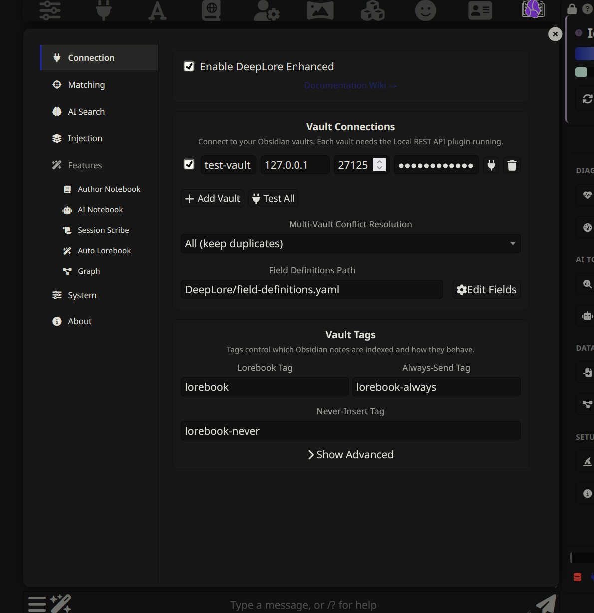
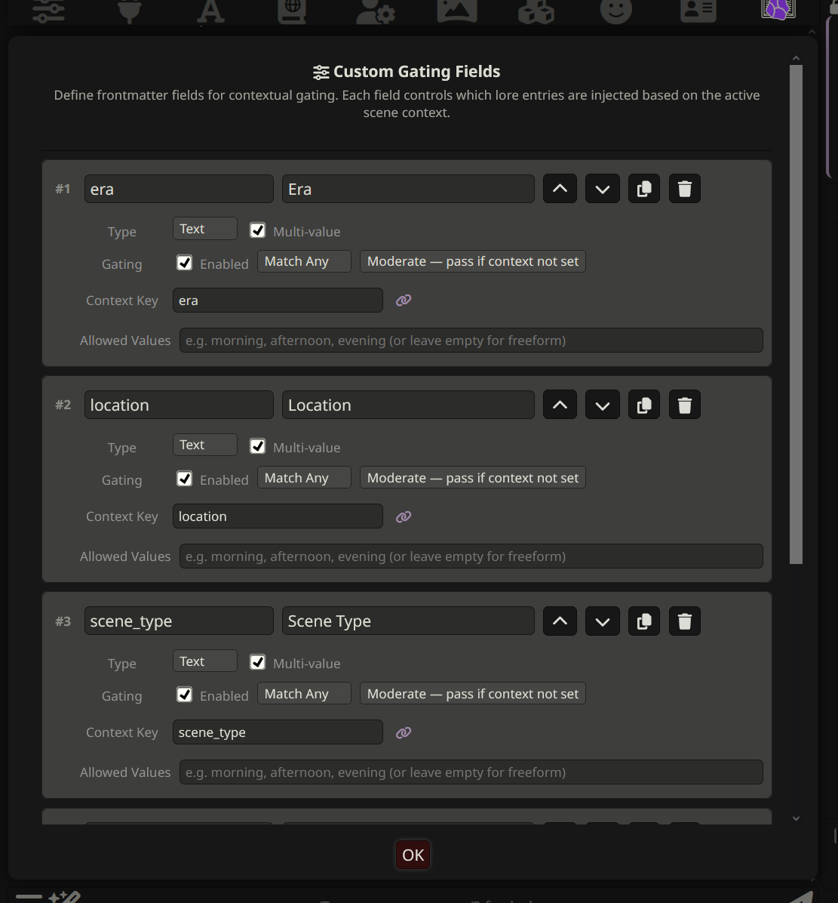

# Settings reference

Every DeepLore setting, with default, range, and effect. Values match `settings.js` defaults; the constraints column matches `settingsConstraints` (numeric clamp ranges enforced on every load).

## Master toggle (About tab)

| Setting | Default | Range | Description |
|---------|---------|-------|-------------|
| **Enable DeepLore Enhanced** | Off | Toggle | Master switch (`enabled`). When off, no entries match, no AI calls run, no prompts get injected. The setting is mirrored in the bottom of the SillyTavern Extensions panel and on the About tab of the settings popup. |

## Vault connections (Connection tab → Obsidian sub-tab)

DLE supports multiple Obsidian vaults. Each vault has its own host, port, API key, HTTPS toggle, and enable flag. Entries from all enabled vaults merge into one index, disambiguated by `vaultSource`.

| Field | Default | Description |
|-------|---------|-------------|
| **Vault Name** | (none) | Display name. Must match the actual Obsidian vault name exactly so deep links into Obsidian resolve. |
| **Host** | `127.0.0.1` | IP or hostname of the machine running Obsidian. Change for remote vault connections. |
| **Port** | `27123` | Port for the Obsidian Local REST API plugin. The plugin listens on `27123` for HTTP and `27124` for HTTPS by default. |
| **HTTPS** | Off | Toggle to use HTTPS. Requires a trusted certificate (the plugin's self-signed cert must be in your OS trust store, or you've imported it via the auto-diagnostic flow). |
| **API Key** | (none) | Bearer token from the Local REST API plugin's settings. Stored plaintext in ST's extension settings JSON. |
| **Enabled** | On | Toggle this vault on/off without deleting the connection. |

**Add Vault** adds another connection. **Test All** verifies every enabled connection. **Scan Vaults** sweeps a port range looking for responding Local REST API instances.

| Setting | Default | Range | Description |
|---------|---------|-------|-------------|
| **Multi-Vault Conflict Resolution** | `all` | Dropdown | How to handle entries with the same title across vaults. `all`: keep all (disambiguated by vault source). `first`: keep the first vault's version. `last`: keep the last vault's version. `merge`: merge content from all vaults. |

## Vault tags (Connection tab → Obsidian sub-tab)

| Setting | Default | Description |
|---------|---------|-------------|
| **Lorebook Tag** | `lorebook` | Obsidian tag (without `#`) that marks a note as a lorebook entry. Only notes with this tag get indexed. |
| **Always-Send Tag** | `lorebook-always` | Tag that forces a note to always inject regardless of keyword matches. Equivalent to `constant: true`. |
| **Never-Insert Tag** | `lorebook-never` | Tag that prevents a note from ever being injected, even on keyword match. Good for drafts or WIP notes. |
| **Seed Tag** | `lorebook-seed` | Tag for entries whose content is sent to the AI as story context on new chats. Not injected; only informs AI selection. See [[Features#New Chat Features]]. |
| **Bootstrap Tag** | `lorebook-bootstrap` | Tag for entries that force-inject when chat is short, then become regular entries. See [[Features#New Chat Features]]. |
| **Librarian Guide Tag** | `lorebook-guide` | Tag for entries Emma reads but the writing AI never sees. Used for writing-style guides. The conflict rule: if both `lorebook-guide` and a regular lorebook tag are set, `guide` wins at runtime. |
| **New Chat Threshold** | `3` | 1-20 | Message count below which seed context is sent and bootstrap entries force-inject. |

## Field definitions path (Connection tab → Obsidian sub-tab)

| Setting | Default | Description |
|---------|---------|-------------|
| **Field Definitions Path** | `DeepLore/field-definitions.yaml` | Vault path to the YAML file containing custom gating field definitions. **Edit Fields** opens the visual rule builder (add, remove, modify custom gating fields with type, operator, tolerance). The four default fields (`era`, `location`, `scene_type`, `character_present`) live in this file too. |

## AI connections (Connection tab → AI Connections sub-tab)

This sub-tab houses one accordion section per AI feature. Each section configures a connection channel: AI Search, Session Scribe, Auto Lorebook, AI Notepad (extract mode), Librarian, and Optimize Keys. The per-feature connection settings live with the feature in this reference, so look up each setting in its own section below.

`Inherit` mode means a feature reuses the AI Search connection. AI Search is the only feature that cannot inherit (it is the source). Librarian's default mode is `inherit` (changed in settings v3); other features default to `inherit` as well. Each feature can override mode, profile, proxy URL, and model independently. The channels are deliberately independent so users can route Emma to a tool-calling model while AI search runs on something cheap.

## Search mode (Matching tab)

| Setting | Default | Description |
|---------|---------|-------------|
| **Search Mode** | `two-stage` | Dropdown. `keywords-only`: keywords only, no AI. `two-stage`: keywords pre-filter, then AI selects from the manifest. `ai-only`: full vault sent to AI. See [[AI Search]]. |

## Matching and budget (Matching tab)

| Setting | Default | Range | Description |
|---------|---------|-------|-------------|
| **Messages to Search** (Scan Depth) | `4` | 0-100 | Number of recent chat messages scanned for keyword matches. Set to 0 to disable keyword matching (AI search only). |
| **Auto-match active character** | Off | Toggle | Auto-match the active character's vault entry by name or keyword, even when not mentioned in chat. See [[Features#Active Character Boost]]. |
| **Flexible Matching (BM25)** | Off | Toggle | Supplement keyword matching with BM25/TF-IDF scoring. Catches partial or approximate keyword matches. The inverted index is built during index build. |
| **Match Sensitivity** (Fuzzy Min Score) | `0.5` | 0.1-2.0 | Shown when Flexible Matching is on. Minimum BM25 score for a fuzzy match. Lower is more permissive, higher is stricter. |
| **Unlimited Entries** | Off | Toggle | Remove the cap on how many entries get injected per generation. |
| **Max Entries** | `10` | 1-100 | Maximum entries to inject when Unlimited Entries is off. Sorted by priority. |
| **Unlimited Token Budget** | Off | Toggle | Remove the token budget cap. A warning toast fires if injected lore exceeds 20% of context. |
| **Token Budget** | `3072` | 100-100000 | Maximum total tokens to inject when Unlimited Token Budget is off. Entries are added in priority order until the budget hits. |

### Repetition control (Matching tab)

| Setting | Default | Range | Description |
|---------|---------|-------|-------------|
| **Enable Repetition Control** (Entry Decay) | Off | Toggle | Track entry freshness and adjust AI manifest priorities. Stale entries get a boost; frequently injected entries get a penalty. See [[Features#Entry Decay & Freshness]]. |
| **Boost After N Skips** | `5` | 2-20 | Consecutive generations an entry is skipped before its freshness boost kicks in. |
| **Penalize After N in a Row** | `2` | 2-10 | Consecutive generations an entry is injected before its frequency penalty kicks in. |

### Matching advanced (Matching tab → Show Advanced)

| Setting | Default | Range | Description |
|---------|---------|-------|-------------|
| **Case Sensitive** | Off | Toggle | When on, keyword matching respects case (`Eris` will not match `eris`). |
| **Match Whole Words** | Off | Toggle | When on, keywords use word boundaries (`war` will not match `warning`). |
| **Keyword Occurrence Weighting** | Off | Toggle | Entries with more keyword occurrences in the scan text sort higher within the same priority tier. May increase processing time on large vaults. |
| **Chain Matching** (Recursive Scanning) | Off | Toggle | After initial matches, scan matched entries' content for keywords that trigger more entries. |
| **Max Recursion Steps** | `3` | 1-10 | Maximum recursive scan passes. |
| **Repeat Cooldown** (Re-injection Cooldown) | `0` | 0-50 | Skip re-injecting an entry for N generations after last injection. 0 disables. Constants are exempt. |
| **Skip Recently Injected** (Strip Duplicate Injections) | On | Toggle | Skip re-injecting entries already injected in recent generations. Tracked per-chat. Constants are exempt. |
| **Messages to check** (Lookback Depth) | `2` | 1-10 | Number of previous generations to check for already-injected entries. Higher values dedupe more aggressively. |
| **Filter Strictness** (Contextual Gating Tolerance) | `strict` | Dropdown | How strictly contextual gating filters entries. `strict`: block when context dimensions are missing. `moderate`: block only on direct mismatch. `lenient`: allow when no context dimensions are set. Custom fields can override per-field. |

## Injection (Injection tab)

| Setting | Default | Description |
|---------|---------|-------------|
| **Injection Mode** | `extension` | Radio. `extension`: classic `setExtensionPrompt()` with fixed position/depth/role. `prompt_list`: registers named prompts (`deeplore_constants`, `deeplore_lore`) that appear in SillyTavern's Prompt Manager list. Drag them wherever you want. Requires Chat Completion API. |

The Injection Overview table on the Injection tab covers three injection types (Lore Entries, Author's Notebook, AI Notepad), each with its own position, depth, and role. Constants follow the Lore Entries position.

| Setting | Default | Range | Description |
|---------|---------|-------|-------------|
| **Lore Entries: Position** | In-chat | Dropdown | Where to inject lore. Options: Before Main Prompt, After Main Prompt, In-chat @ Depth. |
| **Lore Entries: Depth** | `4` | 0-9999 | Chat depth for in-chat injection (0 is the last message). |
| **Lore Entries: Role** | System | Dropdown | Message role for in-chat injection: System, User, or Assistant. |
| **Author's Notebook: Position** | In-chat | Dropdown | Same options as Lore Entries. |
| **Author's Notebook: Depth** | `4` | 0-9999 | Chat depth. |
| **Author's Notebook: Role** | System | Dropdown | System, User, or Assistant. |
| **AI Notepad: Position** | In-chat | Dropdown | Same options as Lore Entries. |
| **AI Notepad: Depth** | `4` | 0-9999 | Chat depth. |
| **AI Notepad: Role** | System | Dropdown | System, User, or Assistant. |
| **Show Lore Sources Button** | On | Toggle | Add a book icon to AI messages showing which entries were injected and why. See [[Features#Context Cartographer]]. |
| **Injection Template** | `<{{title}}>\n{{content}}\n</{{title}}>` | Text | Format for each injected entry. `{{title}}` is the entry name, `{{content}}` is the note body. |
| **Allow World Info Scan** | Off | Toggle | Let SillyTavern's built-in World Info system scan injected lore for WI keyword matches. Enables cross-system triggering. |

> Entries can override position, depth, and role via frontmatter. See [[Writing Vault Entries]].
>
> In `prompt_list` mode, the global Lore Entries position/depth/role settings are ignored. The Prompt Manager controls placement. Per-entry frontmatter overrides with custom depth or position still create separate injection groups that bypass the PM.

## AI search (AI Search tab)

Visible when Search Mode is `two-stage` or `ai-only`.

| Setting | Default | Range | Description |
|---------|---------|-------|-------------|
| **Connection Mode** | `profile` | Radio | `profile` uses a saved Connection Manager profile (recommended). `proxy` routes through ST's CORS proxy to a separate proxy server. |
| **Connection Profile** | (none) | Select | Profile mode. Pick a saved Connection Manager profile. Any provider works. |
| **Proxy URL** | `http://localhost:42069` | Text | Proxy mode. URL of the claude-code-proxy or compatible endpoint. Must expose `/v1/messages`. Routed through ST's CORS proxy; requires `enableCorsProxy: true` in `config.yaml`. |
| **Model Override** | (none) | Text | Optional model override. In profile mode, leave empty to use the profile's model. In proxy mode, specify the model name. |
| **Max Response Tokens** | `1024` | 64-4096 | Token limit for the AI response. Keep low; only a small JSON array is needed. |
| **Timeout (ms)** | `20000` | 1000-999999 | Maximum wait before falling back to keyword-only results. Local models may need 60000-120000ms; cloud APIs typically respond in 5000-15000ms. Cap is intentionally permissive — set this past 120000ms only if you know your provider routinely runs longer. |
| **AI Confidence Threshold** | `low` | Dropdown | Minimum confidence level for AI selections. `low`: accept all (high+medium+low). `medium`: accept medium and high. `high`: high only. |
| **AI Error Fallback** | `keyword` | Dropdown | What to inject when AI search errors out. `keyword`: fall back to keyword-matched results. `constants_only`: constants only. `bootstrap_only`: constants and bootstrap entries. `none`: nothing. |
| **AI Empty Result Fallback** | `constants` | Dropdown | What to inject when the AI intentionally returns `[]`. `constants`: constants only. `constants_bootstrap`: constants and bootstrap entries. `keyword`: keyword results. `none`: nothing. |

**Test AI Search** tests the connection. **Preview AI Prompt** shows the full prompt that would be sent. **AI Stats** shows session usage: AI calls, cache hits, estimated input/output tokens.

### AI search prompt and context (AI Search → Show Prompt & Context)

| Setting | Default | Range | Description |
|---------|---------|-------|-------------|
| **Messages Sent to AI** (AI Scan Depth) | `4` | 1-100 | Number of recent messages sent to the AI for context. Can differ from the keyword scan depth. |
| **Max Summary Length (chars)** (Entry Description Length) | `600` | 100-1000 | Max characters for entry descriptions in the AI manifest. Only applies to entries without a `summary` field. |
| **System Prompt Override** | (none) | Text | Custom system prompt for AI selection. Empty uses the default. Supports the `{{maxEntries}}` placeholder. |
| **Claude system prefix** (Prepend "You are Claude Code") | Off | Toggle | Proxy mode only. Prepends `You are Claude Code.` to the AI system prompt. Enable when routing a Claude model through the proxy. |
| **Force merge system prompt into user message** | Off | Toggle | Merge the system prompt into the user message. Use when the provider rejects or mishandles the system role (e.g., some Z.AI GLM versions). Try Prompt Post-Processing Semi/Strict first. |
| **Use Session Notes as AI Context** | Off | Toggle | Feed the Session Scribe's latest summary into AI search context for better entry selection. See [[Features#Use Session Notes as AI Context]]. |

### AI search filtering (AI Search → Show Filtering)

| Setting | Default | Range | Description |
|---------|---------|-------|-------------|
| **Category Pre-filter** (Hierarchical Pre-filter) | Off | Toggle | When on, large candidate sets (40+ keyword matches across 4+ categories) are narrowed by category in an extra AI call before final selection. When off, all keyword-matched entries go directly to the AI. |
| **Category Filtering Strength** (Hierarchical Aggressiveness) | `0.8` | 0.0-0.8 | How aggressively the category pre-filter culls entries. 0.0 keeps all categories. 0.8 trims up to 80%. The safety valve falls back to the full manifest if filtering would remove more than this fraction. |
| **AI Entry Description Mode** (Manifest Summary Mode) | `prefer_summary` | Dropdown | How entry descriptions are built for the AI manifest. `prefer_summary`: use `summary` if present, fall back to truncated content. `summary_only`: only include entries with summaries. `content_only`: always truncate content, ignore summaries. |

### Optimize Keys (AI Search → Show AI Utilities)

Settings for the `/dle-optimize-keys` command, which refines entry keywords using AI analysis.

| Setting | Default | Range | Description |
|---------|---------|-------|-------------|
| **Optimize Keys Mode** | `keyword` | Dropdown | `keyword`: refine existing keywords without AI. `two-stage`: use AI to analyze entry content and suggest better keywords. |
| **Optimize Keys Prompt** | (none) | Text | Override the default optimization prompt. |
| **Connection Mode** | `inherit` | Radio | `inherit` uses the AI Search connection. Or pick `profile` (saved profile) or `proxy`. |
| **Connection Profile** | (none) | Select | Profile mode only. |
| **Proxy URL** | `http://localhost:42069` | Text | Proxy mode only. |
| **Model Override** | (none) | Text | Override the model used for keyword optimization. |
| **Max Tokens** | `1024` | 256-8192 | Maximum tokens for the optimization response. |
| **Timeout (ms)** | `30000` | 5000-999999 | Request timeout for optimization calls. |

## Author's Notebook (Features tab → Author Notebook)

| Setting | Default | Description |
|---------|---------|-------------|
| **Enable Author's Notebook** | Off | A persistent per-chat scratchpad injected into every generation. Edit via `/dle-notebook` or **Open Author Notebook**. See [[Features#Author's Notebook]]. |

Position, depth, and role for the Author's Notebook live on the Injection tab. See the Injection table above.

## AI Notepad (Features tab → AI Notebook)

AI-managed session notes that accumulate context across a conversation. The AI either writes notes inline using `<dle-notes>` tags (`tag` mode) or a post-generation extraction call pulls notes from the AI's response (`extract` mode). The accumulated notes get injected alongside regular lore. See [[Features#AI Notepad]].

| Setting | Default | Range | Description |
|---------|---------|-------|-------------|
| **Enable AI Notepad** | Off | Toggle | Enable AI-managed session notes that persist across a conversation. |
| **Capture Mode** | `tag` | Radio | `tag`: AI uses `<dle-notes>` tags inline during generation. Free, no extra API calls. Best with flagship models. `extract`: a separate post-generation call extracts notes. Works with any writing model. Costs one extra API call per message. |
| **Custom Tag Instruction** | (none) | Text | Custom instruction prompt for tag mode. Empty uses the default. |
| **Custom Extraction Prompt** | (none) | Text | Custom extraction prompt for extract mode. Empty uses the default. |
| **Connection Mode** | `inherit` | Radio | Extract mode only. `inherit` uses AI Search. Or `profile`/`proxy`. |
| **Connection Profile** | (none) | Select | Extract mode, profile only. |
| **Proxy URL** | `http://localhost:42069` | Text | Extract mode, proxy only. |
| **Model Override** | (none) | Text | Extract mode. Override the extraction model. |
| **Max Response Tokens** | `1024` | 256-8192 | Extract mode. Maximum tokens for the extraction response. |
| **Timeout (ms)** | `30000` | 5000-999999 | Extract mode. Request timeout. |

Position, depth, and role for the AI Notepad live on the Injection tab.

## Session Scribe (Features tab → Session Scribe)

| Setting | Default | Range | Description |
|---------|---------|-------|-------------|
| **Enable Session Scribe** | Off | Toggle | Auto-summarize sessions to your Obsidian vault. See [[Features#Session Scribe]]. |
| **Auto-Scribe Every N Messages** | `5` | 1-50 | Number of new messages between automatic summaries. Tracked by chat position. |
| **Session Folder** | `Sessions` | Text | Vault folder where session notes get saved. Created if missing. |
| **Messages to Include** | `20` | 5-100 | Number of recent chat messages included as context for the summary. |
| **Custom Summary Prompt** | (none) | Text | Override the default summary prompt. The default covers events, character dynamics, revelations, and state changes. |
| **Connection Mode** | `inherit` | Radio | `inherit` uses AI Search. Or `profile`/`proxy`. |
| **Connection Profile** | (none) | Select | Profile mode only. |
| **Proxy URL** | `http://localhost:42069` | Text | Proxy mode only. |
| **Model Override** | (none) | Text | Override the model used for summaries. |
| **Max Response Tokens** | `1024` | 256-4096 | Maximum tokens for the summary response. |
| **Timeout (ms)** | `60000` | 5000-999999 | Request timeout for summary generation. |

## Auto Lorebook (Features tab → Auto Lorebook)

| Setting | Default | Range | Description |
|---------|---------|-------|-------------|
| **Enable Auto Lorebook** | Off | Toggle | AI analyzes chat for entities not in the lorebook and suggests new entries with human review. See [[Features#Auto Lorebook]]. |
| **Interval (messages)** | `10` | 3-50 | Trigger auto-suggest every N messages. |
| **Target Folder** | (none) | Text | Obsidian folder for new entries. Empty saves to vault root. |
| **Write directly (skip review popup)** | Off | Toggle | When on, auto-suggested entries write to the vault immediately without the review popup. Use with caution. |
| **Custom Prompt** | (none) | Text | Override the default auto-suggest prompt. |
| **Connection Mode** | `inherit` | Radio | `inherit` uses AI Search. Or `profile`/`proxy`. |
| **Connection Profile** | (none) | Select | Profile mode only. |
| **Proxy URL** | `http://localhost:42069` | Text | Proxy mode only. |
| **Model Override** | (none) | Text | Override the model used for suggestions. |
| **Max Tokens** | `2048` | 256-4096 | Maximum tokens for the suggestion response. |
| **Timeout (ms)** | `30000` | 5000-999999 | Request timeout for auto-suggest generation. |

Use `/dle-newlore` to trigger on-demand at any time.

## Librarian (Features tab → Librarian)

Tool-assisted lore retrieval and gap detection. When enabled, the writing AI can call `search_lore` and `flag_lore` tools during generation to look up vault entries and flag missing lore. The Librarian session UI (`/dle-librarian`) opens an interactive chat with Emma for drafting new entries. See [[Features#Librarian]].

### Tools

| Setting | Default | Range | Description |
|---------|---------|-------|-------------|
| **Enable Librarian** | Off | Toggle | Enables Librarian generation-time tools and the interactive session UI. Auto-enables function calling on the active connection. |
| **Allow vault searches during generation** (Search Tool) | On | Toggle | Enables the `search_lore` tool during generation (gated by Enable Librarian). |
| **Allow flagging missing lore** (Flag Tool) | On | Toggle | Enables the `flag_lore` tool during generation (gated by Enable Librarian). |
| **Show tool call details on messages** | On | Toggle | Show the "Consulted lore vault" dropdown on assistant messages when the AI used Librarian tools. |
| **Per-message activity** | Off | Toggle | When on, gap and flag records are tied to messages: cleared on new generation, kept on swipe, dropdown data persisted per-message. When off (default), gaps accumulate and dropdowns are ephemeral. |
| **Searches per reply** | `2` | 1-10 | Maximum `search_lore` calls per generation. |
| **Results per search** | `5` | 1-20 | Maximum entries returned per `search_lore` call. |
| **Result size limit (tokens)** | `1500` | 500-5000 | Token budget for search results returned to the AI per call. |

### Writing sessions

| Setting | Default | Range | Description |
|---------|---------|-------|-------------|
| **Write Folder** | (none) | Text | Destination folder in Obsidian for entries written from Librarian sessions. Empty saves to vault root. |
| **Auto-draft when opening a gap** (Auto-Send on Gap) | On | Toggle | Automatically send the draft prompt when opening a flagged gap in the Librarian session. |
| **Connection Mode** | `inherit` | Radio | `inherit` (use AI Search), `profile` (saved profile), or `proxy`. The default is `inherit` as of settings v3. Librarian intentionally has its own channel so users can route Emma to a different model. |
| **Connection Profile** | (none) | Select | Profile mode only. |
| **Proxy URL** | `http://localhost:42069` | Text | Proxy mode only. |
| **Model Override** | (none) | Text | Override the model. Empty inherits from AI Search (when in `inherit` mode). |
| **Session Max Tokens** | `4096` | 1024-16384 | Maximum tokens for Librarian session responses. |
| **Session Timeout (ms)** | `120000` | 10000-999999 | Request timeout for Librarian session AI calls. The 120s default leaves headroom for forced-final-response loops on large contexts and reasoning models. |

### Writing sessions advanced

| Setting | Default | Range | Description |
|---------|---------|-------|-------------|
| **Manifest Budget (chars)** | `8000` | 0-200000 (UI: 2000-30000) | Maximum characters for the vault manifest in Librarian session prompts. Char-based truncation; divide by ~3.5 for a token estimate. |
| **Related Entries Budget (chars)** | `4000` | 0-200000 (UI: 1000-10000) | Maximum characters for related-entries context. |
| **Chat Context Budget (chars)** | `4000` | 0-200000 (UI: 1000-10000) | Maximum characters for chat context. |
| **Draft Budget (chars)** | `4000` | 0-200000 (UI: 2000-10000) | Maximum characters for the serialized draft JSON. |
| **System Prompt Mode** | `default` | Radio | `default`: built-in Librarian system prompt. `append`: add custom text after the default. `override`: replace the role/persona section only (manifest, gap context, chat, draft, tools, response format still appended). `strict-override`: pure passthrough, custom text IS the entire system prompt. |
| **Custom System Prompt** | (none) | Text | Custom system prompt text. Used in `append`, `override`, and `strict-override` modes. |

## Graph (Features tab → Graph)

Settings for the interactive entry relationship graph (`/dle-graph`). The graph also has its own in-window settings panel (gear icon) with live sliders and presets. Changes save to your DLE settings and persist.

| Setting | Default | Range | Description |
|---------|---------|-------|-------------|
| **Default Color Mode** | `type` | Dropdown | Initial node coloring scheme. Options: `type` (by entry type), `priority`, `centrality`, `frequency`, `community` (Louvain clusters). |
| **Hover Dim Distance** | `3` | 0-15 | BFS hops kept visible on hover. Nodes farther than this get dimmed. 0 disables. |
| **Focus Tree Depth** | `2` | 1-15 | Hop depth for ego-centric focus mode. Controls how many relationship hops show from the focused node. |
| **Show Labels** | On | Toggle | Show node title labels on the graph. |
| **Repulsion** | `0.3` | 0.1-5.0 | ForceAtlas2 repulsion coefficient. Higher pushes nodes further apart. |
| **Gravity** | `11.0` | 0.1-20 | Pull toward center. Higher keeps the graph more compact. |
| **Damping** | `0.50` | 0.3-0.98 | Velocity damping. Higher settles faster. |
| **Hover Falloff** | `0.55` | 0.3-0.85 | Transmission per hop for hover dimming. Light propagates as `t^d` (mirrors-and-lasers model). Higher lets light reach further hops; lower dims more aggressively. |
| **Hover Ambient** | `0.06` | 0.0-0.2 | Ambient floor for off-set elements on hover. Nodes beyond the dim distance never go below this opacity. |
| **Edge Filter Alpha** | `0.05` | 0.01-0.5 | Serrano disparity filter threshold. Lower shows fewer (more significant) edges. |
| **Node Size Mode** | `centrality` | Dropdown | How node sizes are determined. `centrality` (size by graph centrality), `priority` (by entry priority), `uniform` (all same). |

Graph physics presets (Compact, Balanced, Spacious, Ginormous) set Repulsion / Gravity / Damping to recommended combinations. Individual sliders fine-tune from there.

## Index and cache (System tab → Show Advanced)

| Setting | Default | Range | Description |
|---------|---------|-------|-------------|
| **Cache Duration (seconds)** | `300` | 0-86400 | How long to cache the vault index before re-fetching. 0 always fetches fresh (slower). |
| **Auto-Sync Interval** | `0` | 0-3600 | Seconds between automatic vault re-checks. 0 disables. See [[Features#Vault Change Detection & Auto-Sync]]. |
| **Show Sync Change Toasts** | On | Toggle | Show toast notifications when vault changes get detected during index refresh. |
| **Index Rebuild Trigger** | `ttl` | Dropdown | When to rebuild the vault index. `ttl`: rebuild when cache duration expires. `generation`: rebuild every N generations. `manual`: only rebuild on explicit refresh. |
| **Rebuild Every N Generations** | `10` | 1-100 | Shown when trigger is `generation`. How many generations between automatic index rebuilds. |

**Refresh Index** clears the cache and re-fetches all entries. **Test Match** simulates a generation to show which entries would match. **Browse** opens the entry browser.

## System advanced (System tab)

| Setting | Default | Range | Description |
|---------|---------|-------|-------------|
| **Review Response Tokens** | `0` | 0-100000 | Token limit for `/dle-review` responses. 0 is auto (uses your connection profile's Max Response Length). |
| **Debug Mode** | Off | Toggle | Log detailed match info to browser console (F12). Shows keyword matches, AI results, gating, token counts, injection details. |

## Internal and migration settings

These keys appear in `defaultSettings` but are not surfaced in the UI as user-editable. Listed here for completeness (power users editing the JSON or reading diagnostics will see them).

| Key | Default | Description |
|---------|---------|-------------|
| `lenientAuthoring` | `true` | Frontmatter parser auto-fixes common authoring mistakes (case-mismatched field names, quoted numbers, comma-string keys) and records a warning. Set to `false` to match pre-v2 strict behavior (silent drops). |
| `drawerPinned` | `false` | Drawer UI state. Whether the drawer is pinned open. |
| `drawerCompactTabs` | `false` | Drawer tabs render as icon-only (`true`) or icon plus text (`false`). |
| `advancedVisible` | `{}` | Per-section "Show Advanced" toggle states. |
| `promptPresets` | `{}` | Saved prompt presets keyed by tool name (`{ [toolKey]: { [presetName]: promptText } }`). |
| `analyticsData` | `{}` | All-time analytics counters. |
| `_wizardCompleted` | `false` | First-run setup wizard completion flag. |
| `settingsVersion` | `3` | Settings schema version. Migrations run on load when stored version is behind. |
| `graphSavedLayout` | `null` | Saved graph node positions: `{ positions: { title: { x, y } }, timestamp }`. |
| `aiSearchEnabled` | `false` | Internal mirror of `aiSearchMode` being non-`keywords-only`. Auto-managed; do not edit. |

## Automatic features (no settings)

These work automatically with no configuration:

- **Obsidian circuit breaker:** the Obsidian connection uses a per-vault circuit breaker (closed/open/half-open) with exponential backoff (2s to 15s). Keyed by `host:port` so each vault has independent failure tracking. Resets when a call succeeds.
- **AI circuit breaker:** AI search has its own circuit breaker (2 consecutive failures to trip, 30s cooldown). Prevents repeated full-timeout waits when the AI service is down. The AI throttle (500ms minimum between calls) does not trip the breaker. User aborts, timeouts, rate-limit (429), and auth errors also do not trip the breaker.
- **IndexedDB persistent cache:** the parsed vault index is saved to IndexedDB (`DeepLoreEnhanced` database, `vaultCache` store) after every successful build. On page load, hydrates instantly from cache, then validates in background.
- **Reuse sync:** auto-sync fetches all file contents but skips re-parsing/tokenizing unchanged entries (detected by content hash). Falls back to full rebuild automatically if reuse fails.
- **Hierarchical manifest clustering:** for vaults with 40+ selectable entries and 4+ categories, the optional Category Pre-filter uses a two-call AI approach for better scaling. Off by default.
- **Sliding window AI cache:** AI search cache tracks manifest and chat hashes separately for smarter cache reuse. New chat lines are reused unless they reference vault entities.
- **Confidence-gated budget:** AI search over-requests entries (2x), sorts by confidence tier before applying the budget cap.
- **Prompt cache optimization:** in proxy mode, the manifest is placed first with `cache_control` breakpoints for Anthropic prompt caching. Profile mode does not currently support `cache_control`.
- **Settings migrations:** version 1→2 consolidated Librarian model fields. Version 2→3 changed Librarian default connection mode from `profile` to `inherit` for unconfigured users. Existing explicit profile selections are preserved.
