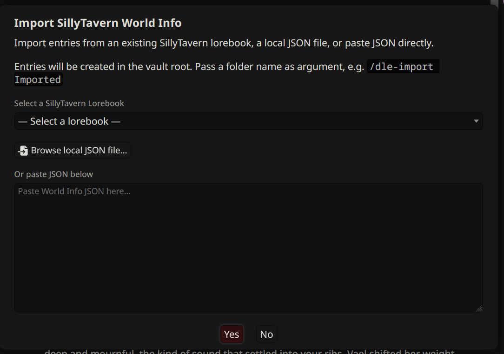

# Setup & Import

Onboarding tools and the World Info importer. Use the setup wizard to configure DeepLore for the first time, then import existing SillyTavern lorebooks into your Obsidian vault.

---

## Setup wizard

A 9-page first-run wizard. Walks through Obsidian connection, lorebook tag, search mode, AI search connection, Librarian setup, vault structure, and a one-shot World Info import. Each page validates before letting you advance.

**Open it:** run `/dle-setup`. The wizard also opens automatically the first time you load DeepLore.

You can re-run the wizard any time. It prefills from your current settings, so re-running is non-destructive unless you change a value.

---

## Quick actions

A toolbar at the top of the drawer (above the tab content) with one-click buttons for the operations you do most. Buttons run the same code paths as their slash commands; no roundtrip through the parser.

| Button | Icon | Action | Slash command |
|---|---|---|---|
| **Refresh** | sync | Reload the vault index from Obsidian. | `/dle-refresh` |
| **Scribe** | feather | Run Session Scribe: AI summarizes the conversation and writes notes back to the vault. | `/dle-scribe` |
| **New Lore** | plus | Open the new-entry editor. | `/dle-newlore` |
| **Librarian** | book-bookmark | Open the Librarian chat (Emma) for authoring entries. | `/dle-librarian` |
| **Graph** | diagram-project | Open the relationship graph. | `/dle-graph` |
| **Clear AI Cache** | eraser | Clear the AI search cache so the next generation re-selects lore from scratch. | (drawer only) |
| **Skip Librarian** | ban | Skip the Librarian agentic loop for the next generation. Toggle. | (drawer only) |

Keyboard shortcuts when the drawer has focus: `r` refresh, `s` scribe, `n` new lore, `g` graph.

---

## ST lorebook import bridge

Convert SillyTavern World Info JSON into Obsidian vault entries with proper frontmatter. Handles three input formats: ST World Info export JSON, V2 character cards with embedded World Info, and raw entry arrays.

**Open it:** `/dle-import [folder]`. Without a folder argument, entries are written to the vault root. Example: `/dle-import Imported` writes to the `Imported/` folder.

Three ways to feed the importer:

- **Select** an existing ST lorebook from the dropdown (lists everything in your ST World Info library).
- **Browse** a local JSON file from disk.
- **Paste** JSON text directly into the textarea.

### What converts

- `key` to `keys` (primary keywords; comma-string format from older exports auto-split)
- `keysecondary` to `refine_keys` (AND-ANY secondary keys)
- `comment` to entry title (falls back to first key, then `Entry_<uid>`)
- `order` to `priority` (1-100, default 50; **see semantic flip below**)
- `position` to `position` (5 ST positions mapped to `before` / `after` / `in_chat`; the original ST value is preserved as a YAML comment)
- `depth` to `depth` (only when `position: in_chat`)
- `probability` to `probability` (rescaled from 0-100 to 0.0-1.0 automatically)
- `constant: true` to the `lorebook-always` tag
- `scanDepth` to `scanDepth`
- `sticky`, `delay`, `group`, `groupWeight` preserved as frontmatter for round-tripping (see [[For World Info Users]] for which of these DLE actually enforces)

### What doesn't convert

- `role` (system/user/assistant for in-chat injections) is dropped on import.
- `excludeRecursion` is dropped on import.
- `disable` is dropped (DLE entries default to enabled).
- `selectiveLogic` modes other than AND_ANY are dropped (DLE is AND_ANY only).
- Regex keys are imported as literal strings.

See [[For World Info Users]] for the full field-mapping cheat sheet and the two semantic gotchas (priority order and position mapping).

### After import

- The importer emits a one-shot warning toast: *"WI 'Order' is inverted in DLE Priority (lower = higher priority). Verify your entries sort as expected."* Read it.
- A duplicate filename is suffixed `_imported`, `_imported_2`, and so on, up to 20 attempts. Files are never silently overwritten.
- If AI search is enabled, the importer offers to generate AI summaries for the imported entries (replacing the default `"Imported from SillyTavern World Info"` placeholder). You review each summary before write.
- The vault index rebuilds once at the end. Don't trigger `/dle-refresh` mid-import.

**When to use it:** migrating from SillyTavern's built-in World Info to an Obsidian vault. Import once, then enrich the entries with summaries, wikilinks, and the additional frontmatter fields DLE supports. Running both extensions side by side works but doubles your maintenance and can double-inject entries.
